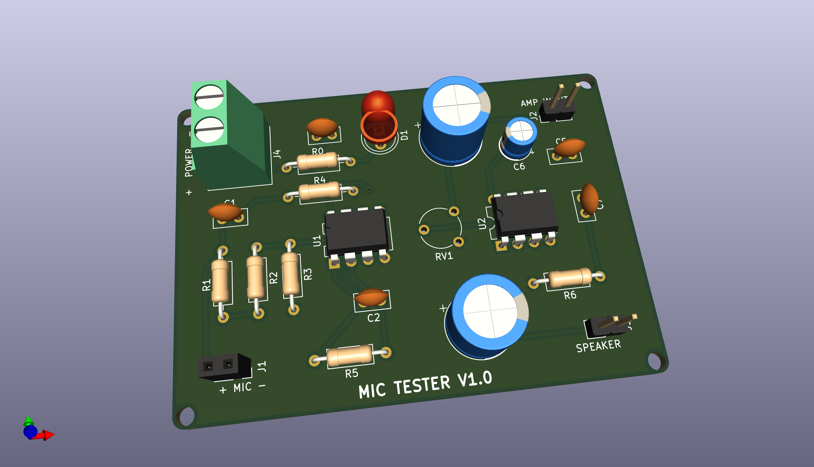

# mic-tester-lm358-lm386

* This repo is for learning purpose!

* The [mic_tester](https://github.com/kawashimaken/mic-tester-lm358-lm386/tree/main/mic_tester) folder contains all files for KiCad.

* Feel free to play with it.

* It will be appriciated if you have any feedback or suggestions to improve it!

# Heavily inspired by the following article

* （EC044T-R1
コンデンサーマイク（ECM)
チェッカー）：http://www.or2.fiberbit.net/takehiko-inoue01/denshikousaku2013.html#_EC044T-R1

